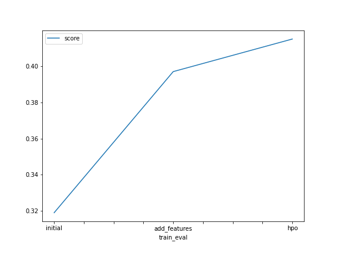
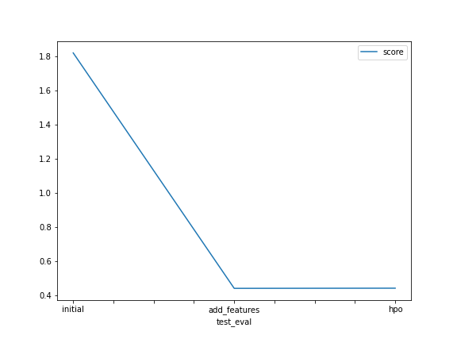

# Report: Predict Bike Sharing Demand with AutoGluon Solution
#### Sepehr Keykhaie

## Initial Training
### What did you realize when you tried to submit your predictions? What changes were needed to the output of the predictor to submit your results?
Kaggle does not accept negative predictions. We should remove them before submitting the results.

### What was the top ranked model that performed?

## Exploratory data analysis and feature creation
### What did the exploratory analysis find and how did you add additional features?
I categorized the hours to different rush hours, categorized weather and categorized wind speed. 

### How much better did your model preform after adding additional features and why do you think that is?
Its performace improved about 75.5 per cent. 

## Hyper parameter tuning
### How much better did your model preform after trying different hyper parameters?
It improved about 75%

### If you were given more time with this dataset, where do you think you would spend more time?
Tuning hyper parameters and analyse data more.

### Create a table with the models you ran, the hyperparameters modified, and the kaggle score.
|model|
|WeightedEnsemble_L3|
|initial|1.82|
|add_features|0.441|
|hpo|0.442|

### Create a line plot showing the top model score for the three (or more) training runs during the project.

TODO: Replace the image below with your own.

### Create a line plot showing the top kaggle score for the three (or more) prediction submissions during the project.

TODO: Replace the image below with your own.

## Summary
The initial model results in score of 1.82. Adding more features such as seperating hour and categorizing the rush time, weather condition, and wind speed really helped to improved the score. Playing with hyper parameters did not improve the score. Considering the dedicated time and resource limitation on the cloud, I didn't try different hyper parameter combinations.  
